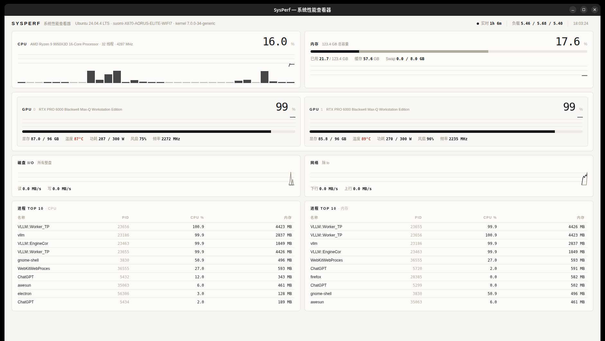

# SysPerf · Ubuntu 性能看板

极简线条风格的 Linux 系统性能实时监控看板（桌面应用）。纸感米白 + 墨色细线，无阴影、无渐变、无多余色彩，只在温度超限时出现红色警示。



## 功能

| 模块 | 内容 |
|------|------|
| CPU | 总占用率、32 核逐核柱状图、实时频率、型号/线程数 |
| 内存 | 已用/缓存/Swap 分色条、总量、5 分钟历史曲线 |
| GPU（多卡） | 利用率、显存、温度（超温变红）、功耗/上限、风扇、频率 |
| 磁盘 I/O | 所有整盘读/写速率双线曲线 |
| 网络 | 上行/下行速率双线曲线（除 lo） |
| 进程 Top 10 | 按 CPU / 按内存两个榜单 |
| 顶栏 | 发行版、主机名、内核、运行时长、负载、时钟 |

- 1 秒刷新，5 分钟历史曲线
- 数据源：`/proc`（stat/meminfo/diskstats/net/dev/各进程 stat）+ `nvidia-smi`
- **完全离线**：本地随机端口 HTTP 回环 + 内嵌渲染，零运行时依赖，不采集、不上传任何信息

## 技术栈

- [Electron](https://www.electronjs.org/) 桌面窗口
- Node.js 标准库采集（`/proc` 差分 + `nvidia-smi` 轮询），无第三方运行时依赖
- 纯 Canvas 手绘图表（无图表库）、单文件 HTML UI

```
SysPerf/
├── main.js        # Electron 主进程 + 本地回环 HTTP 服务
├── stats.js       # 数据采集器（/proc + nvidia-smi，历史环形缓冲）
├── index.html     # 仪表盘 UI（单文件，无外部资源）
├── start.sh       # 启动脚本
├── icons/         # 应用图标（hicolor 图标包，16–256 + scalable SVG）
└── SysPerf.desktop
```

## 安装与运行

要求：Linux（X11 会话）、Node.js ≥ 18、NVIDIA 显卡 + `nvidia-smi`（无 NVIDIA 时 GPU 卡片为空，其余模块正常）。

```bash
git clone https://github.com/SqyLt/sysperf.git
cd sysperf
npm install          # 下载 Electron 二进制
# 国内网络可走镜像：
# ELECTRON_MIRROR="https://npmmirror.com/mirrors/electron/" npm install

npm start            # 或 ./start.sh
```

## 说明

- 默认 `--no-sandbox` 启动（本机个人工具，仅监听 127.0.0.1 随机端口）
- 进程 CPU% 以「100% = 占满一核」计
- 磁盘统计整盘设备（自动排除分区/loop/dm/ram 等虚拟设备）
